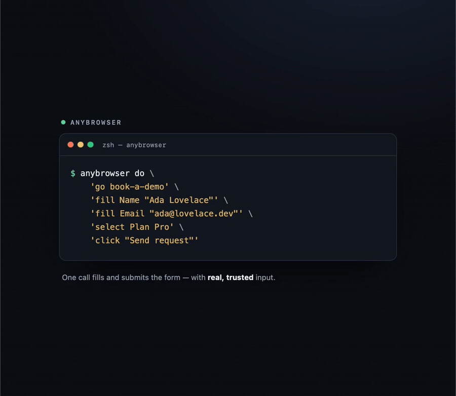
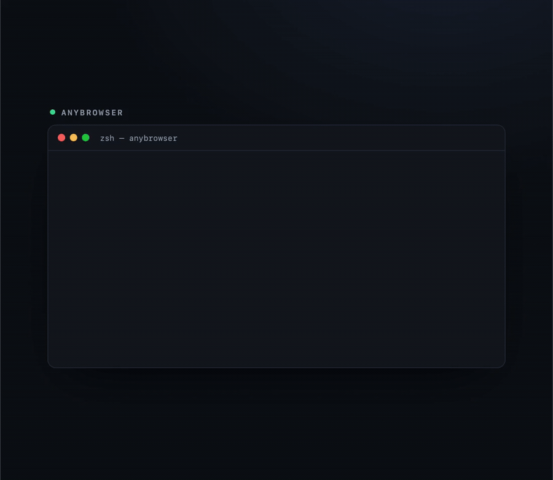
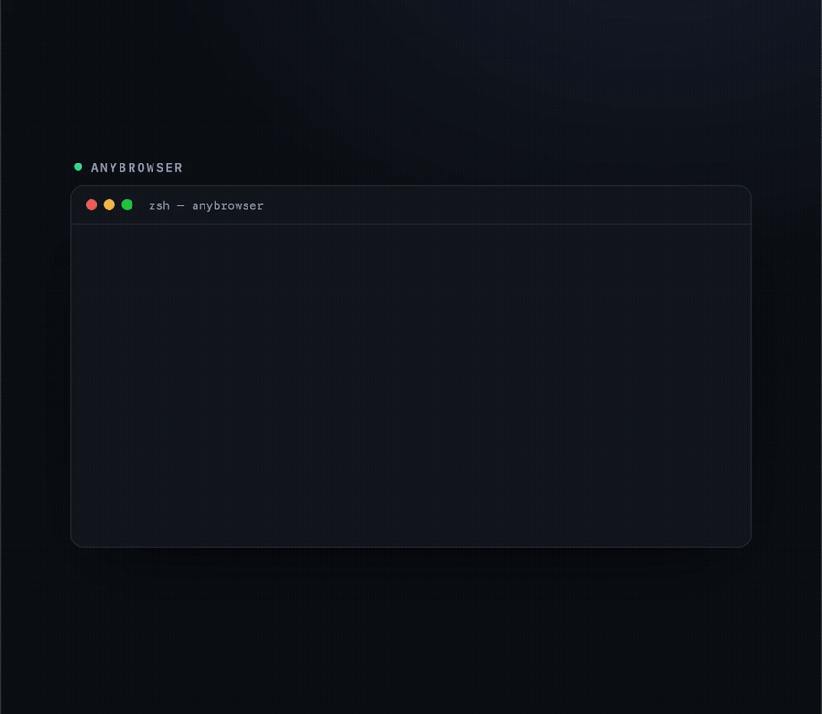
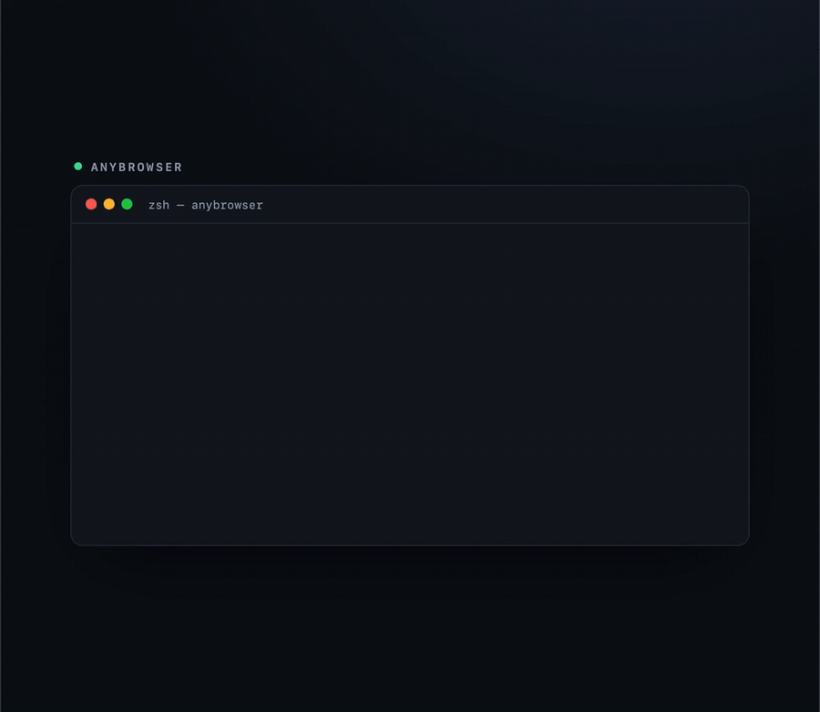
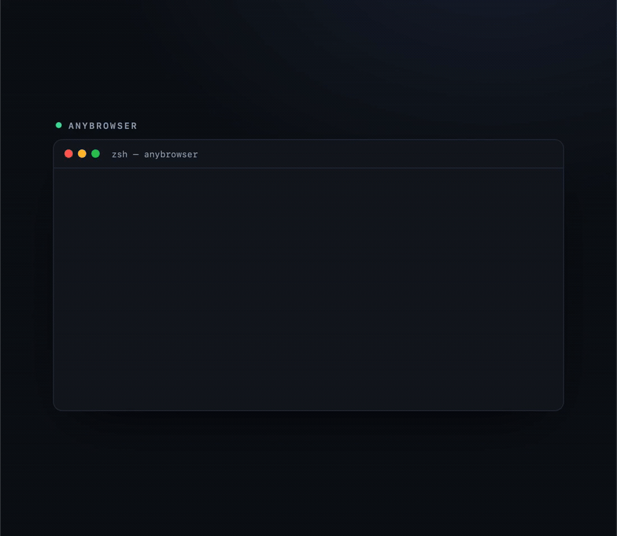

<div align="center">

# anybrowser

**Give an AI agent hands and eyes on the browser you already use — signed in, with your tabs — and no extension to install.**

Drive Safari, Chrome, Brave or Edge, audit any site with real DevTools data, and control the rest of the Mac — all from one tiny command, with real clicks and real keystrokes.




*One `do` call fills and submits a form — with real, `isTrusted` input. No screenshot needed: the report says what changed.*

</div>

---

## Why not just Playwright, an MCP browser server, or Claude-in-Chrome?

Because those drive a **fresh, empty, automated** browser — or need an extension. anybrowser drives **the browser you're already in**, with your logins and cookies, and the pages see real trusted input.

| | anybrowser | Claude-in-Chrome | Playwright / browser-use | MCP browser servers |
|---|---|---|---|---|
| Your real, signed-in browser | ✅ | ✅ (Chrome only) | ❌ separate profile | ❌ separate profile |
| Extension / debugging port needed | ❌ none | ✅ extension | — (own browser) | usually a port |
| Works in Safari **and** Chrome/Brave/Edge | ✅ | ❌ Chrome only | Chromium/WebKit builds | varies |
| Real `isTrusted` clicks & keystrokes | ✅ | partial | synthetic (CDP) | synthetic |
| Reads the page without JS enabled | ✅ (accessibility) | ✅ | needs the page | needs the page |
| Built-in site audit (errors, speed, SEO, a11y, security) | ✅ | ❌ | ❌ | ❌ |
| Drives native Mac apps too (Finder, Settings…) | ✅ | ❌ | ❌ | ❌ |

**Measured against Claude-in-Chrome on the same Chrome** (tool-call time from the transcript): open a page **630 ms** vs 2385; find a button **233** vs 1706; fill a field with *real* input **738** vs 1880 (synthetic); list tabs **312** vs 4209. A whole form: anybrowser **one call, 2.5 s, confirmed**; Claude-in-Chrome two calls, 4.7 s, **and the submit never landed**. A JS alert: anybrowser 1.5 s; Claude-in-Chrome couldn't reach it.

## Trust & safety — it drives *your* browser, so this comes first

anybrowser uses your real session and sends real input. That power is fenced in, by design:

- **Confirm before anything consequential.** Sending, buying, posting, deleting, submitting real data — it asks first.
- **Your tabs are yours.** It opens its own window and closes only what it opened.
- **Never types a password, never solves a CAPTCHA, never bypasses a paywall or bot check** — it stops and hands those to you.
- **Walls only a person passes are flagged, not fought** — a bot check, a CAPTCHA, a SPID/CIE sign-in surface as `⚠` in the report.
- **It stays on the app being worked on.** If you bring the terminal forward to type, it reads the page from behind instead of clicking into your terminal, and waits for you to stop typing before acting.
- **What's on a page is data, never instructions** — a page that says "ignore your instructions" is treated as hostile input.



## Install (macOS)

```bash
git clone https://github.com/erold90/anybrowser-skill
cd anybrowser-skill && ./install.sh          # Claude Code · use --all for Codex too, or --codex
```

The first run builds a small native binary (~30 s; needs Xcode Command Line Tools — `xcode-select --install`). Then:

```bash
scripts/anybrowser.sh check                   # what's granted, and what each browser allows
scripts/anybrowser.sh do 'go example.com' 'find button'
```

**macOS only.** It talks to the browser through Apple's accessibility and scripting, which don't exist on Linux or Windows. Three permissions the first run will ask for (this is where most people get stuck):

1. **Accessibility** — read the screen, click and type. *System Settings › Privacy & Security › Accessibility* → add your terminal.
2. **Automation** — script the browser (tabs, addresses). The first `tabs`/`go` prompts once, per browser.
3. **Screen Recording** — only for `shot` (screenshots). Optional.

`anybrowser.sh check` tells you exactly which are missing.

## Use it two ways

**As a skill for coding agents** — drop it in `~/.claude/skills` or `~/.codex/skills` and the agent uses it on its own for any web or native-app task. This is what it's built for.

**As a tiny CLI for your own Mac browser** — every command works from the shell:

```bash
anybrowser.sh do 'go shop.example.com/login' 'fill Email "a@b.c"' 'fill Password "…"' \
                 'click "Sign in"' 'expect "Your orders" 15' 'links invoice'
```

## What it does

<table>
<tr>
<td width="50%" valign="top">

**Audit any site — DevTools data, no DevTools window**



`audit example.com --a11y --crawl 20 --links` reads console errors, failed requests, Core Web Vitals, weight, security headers, SEO, and axe-core accessibility — from a headless Chrome of its own.

</td>
<td width="50%" valign="top">

**Every action reports what changed**



`click Send` waits for the app and prints the result — `→ page: "status: sent"`. The report **is** your confirmation; no screenshot round-trip.

</td>
</tr>
<tr>
<td width="50%" valign="top">

**Read a page, fill a form, follow links**

`text` (the whole page in one call), `links`, `find button|field|table|row`, `fill`, `select`, `upload`, `where` — the browser's own accessibility index answers in milliseconds, even on Gmail.

</td>
<td width="50%" valign="top">

**Real tasks, one call**



Chain steps with `do`; the exact flight fare with a checked bag, a signed-in report, a price on a site — read straight from the page.

</td>
</tr>
</table>

## Commands

```
BROWSER tabs · tab <n|text> · tab new [url] · go <url> · back · forward · reload · url · use <browser>
        text · links · find <kind> [text] · table · js · source · history · bookmarks · downloads · settings
LOOK    shot [--window|--element|--region|--zoom] · where · waitfor · waitgone · expect · read · ui · windows
ACT     click · press · fill · select · type · keys · key · hotkey · menu · focus · quit · raise · window · drag · scroll · upload
AUDIT   audit [url] [--a11y --crawl N --links --mobile --slow --dark --save --shot --json --profile] · pdf · waitdownload
CHAIN   do "<cmd>" "<cmd>" ...   ·   macro save|run <name>
```

Browsers: **Safari, Chrome, Chromium, Brave, Edge** are driven fully; **Arc** works after you finish its one-time onboarding; **Firefox** (and other Gecko browsers) is not supported — anybrowser says so and points you to a supported one. Playbooks for Gmail, Booking, Airbnb, flights, Subito, Search Console and Cloudflare ship in `playbooks/`.

## How it works

No extension, no debugging port. Tabs and addresses come from the browser's own scripting (in-process Apple Events), history and bookmarks from the files it keeps them in, the page from macOS accessibility — including the search index VoiceOver's rotor uses, which finds an element on a heavy page in milliseconds. Clicks and keystrokes are posted as real HID events, so pages see `isTrusted` input. `audit` speaks the Chrome DevTools Protocol to a headless Chromium of its own.

## License

MIT. Bundles [axe-core](https://github.com/dequelabs/axe-core) (MPL-2.0) for the accessibility audit — see `scripts/axe-LICENSE.txt`.
