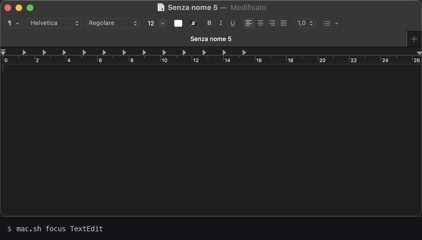

# anybrowser

A [Claude Code](https://claude.com/claude-code) skill that gives the agent eyes and hands
on the macOS desktop — for the apps that have no CLI and no API.

Claude already reads your files and drives your browser. This covers the rest:
Finder, Preview, Xcode, System Settings, installers, the native file picker,
that one legacy app your workflow still depends on.



```bash
scripts/anybrowser.sh click "Save"                     # by name, real pointer
scripts/anybrowser.sh fill "Email" "ada@example.com"   # real keystrokes into a named field
scripts/anybrowser.sh menu TextEdit Format Font "Show Fonts"
scripts/anybrowser.sh upload ~/Desktop/logo.png        # the file dialog a browser can't script
scripts/anybrowser.sh do 'fill Name "Ada"' 'click "Show alert"' 'key return' 'click Send' 'read'
```

## What makes it different

**Every action reports what it changed.** anybrowser listens to the app's
accessibility notifications while it acts, waits for the app to settle, and
answers on the same line:

```
filled Email  [TextField] → focus: Email  [TextField] · value: "ada@example.com"
clicked Show alert  [Button] at 81 405 → dialog: "Test alert" — buttons: OK
clicked Upload file  [StaticText] at 306 433 → window: (untitled) (sheet, file dialog)
clicked Send  [Button] at 64 531 → page: "status: sent name=Ada plan=Pro file=logo.png"
hotkey cmd w → now showing "YouTube"
```

An exit code of 0 only means an event was sent. The report is what tells the
agent it landed — without a screenshot, which costs a second and ~1,700 tokens.
Web pages don't announce their text changing, so in a browser (or an Electron
app) anybrowser compares the visible page before and after: the `page:` line is the
status message, the error or the result the click produced.

**A whole flow in one call.** The slow part of an agent driving a GUI isn't the
click, it's the round trip to the model between clicks. `do` runs a sequence in
one process, and each step waits for what the previous one started: elements
looked up by name are waited for, and a click right after a dialog opens is held
back the half second Chrome ignores input for. In `tests/web.sh`, an alert, two
fields, the native file dialog and a submit run as a single call: 6.8 s in
Safari, 10.5 s in a Chrome launched cold.

**Native, and fast.** One Swift file, compiled on your Mac at install. It talks
to the Accessibility API and posts CoreGraphics events in-process — no
AppleScript, no helper apps, no daemon. On a 2018 Intel MacBook Pro, a click by
name reaches the web page's `mousedown` handler 150–190 ms after the command
starts, lookup and pointer travel included; reading a window's element tree
dropped from ~1 s (JavaScript for Automation) to ~0.1 s.

**Real input.** Clicks and keystrokes are OS events, so pages see `isTrusted`
events: on the test page every click and keystroke counts as real, none as
synthetic, in Safari and Chrome. `keys` sends each character as the key that
produces it on the current layout — SwiftUI apps like Calculator ignore anything
else — and falls back to a Unicode keystroke for what the layout lacks (emoji);
`hotkey` looks keys up the same way.
`press` triggers a control through accessibility without moving the pointer, so
you can keep using your mouse.

**Things that used to break quietly:**
- Retina: `shot` scales to points, so a pixel read off the image is where `click` lands.
- Permissions: without Accessibility, posted events vanish silently. `check`
  moves the pointer one point and reads it back.
- Chromium builds a page's tree only when an assistive app asks. anybrowser asks —
  the way VoiceOver does for Chrome, Brave, Edge, Arc; with `AXManualAccessibility`
  for Electron and CEF apps (VS Code, Slack, Notion, Claude…) — and waits until
  the page has content. Tested cold on Chrome and on the Claude desktop app
  (Electron: 13 elements before, 341 after).
- The system Open panel: `upload` checks it's really in front (identifier
  `open-panel`, the same in every language) before typing a path, waits for the
  Open button to enable, and confirms the dialog closed.
- `type` pastes, then restores whatever was on the clipboard — images and rich
  text included — and marks the pasted text transient for clipboard managers.

## Install

```bash
git clone https://github.com/erold90/anybrowser.git
cd anybrowser && ./install.sh
```

Needs the Swift compiler from the Command Line Tools (`xcode-select --install`;
if you have `git`, you likely have them). The installer copies the skill to
`~/.claude/skills/anybrowser/`, builds the binary (~20 s) and runs `check`. Grant
what it reports in System Settings → Privacy & Security — Accessibility for
everything, Screen Recording for `shot` — then restart your terminal.

## Commands

| | |
|---|---|
| `shot [name] [--window \| --region X Y W H \| --display N]` | Capture, scaled so pixels equal points; a crop says its origin — smaller images, fewer tokens |
| `where <text>` | Elements matching `<text>`, exact name first, with centre points and on/off state |
| `waitfor` · `waitgone` `<text> [secs]` | Return as soon as an element appears · disappears |
| `read` · `ui` `[--all]` | Visible text in order (the page, on a web page) · named elements; `--all` includes off screen |
| `apps` · `windows` · `menus <app> [<menu>…]` · `pos` | Running apps · every window with its frame · a menu bar or a menu's items · the pointer |
| `click` · `dclick` · `rclick` `X Y` or `<name>` | Real clicks, at a point or on the best enabled match |
| `press <name>` | Trigger a control through accessibility, pointer untouched |
| `fill <field> "text"` | Focus a text field by name and replace its content, then read it back |
| `select <menu> <option>` | Pick an option in a pop-up menu or `<select>`; restores the old value if it can't |
| `type "text"` · `keys "text"` | Paste · real keystrokes, any characters |
| `key <name>` · `hotkey "cmd shift" s` | Named keys · shortcuts on the current layout |
| `menu <app> <menu> [<submenu>…] <item>` | A menu item by name, at any depth |
| `focus <app>` · `quit <app>` · `raise <title>` | Front (or launch) an app by its localized name, bundle name or id · quit it like Cmd+Q · front a window by (part of) its title |
| `window move X Y` · `resize W H` · `maximize` · `minimize` · `restore` · `fullscreen` · `close` `[title]` | Arrange the front window, or the one whose title matches — set directly through accessibility, no dragging; the report gives the resulting frame |
| `open <url> [app]` · `upload <file>` | A web page · answer the Open dialog |
| `hover X Y` or `<name>` | Rest the pointer on something: hover menus, tooltips |
| `drag X1 Y1 X2 Y2` or `<name> <name>` | Press, travel, release — by name, it also says whether the item left its place |
| `move X Y` · `scroll N [dx]` | The pointer |
| `do "<cmd>" "<cmd>" …` · `do -` | A sequence in one call, stopping at the first failure · the same from stdin |
| `check` | Which permissions are missing |

The pointer travels instead of jumping: an eased path at ~240 events a second,
25 ms for a short hop up to ~110 ms across the screen — a click by name still
reaches the page in under 200 ms. `ANYBROWSER_GLIDE=0` jumps, `ANYBROWSER_GLIDE=<ms>`
fixes the travel time. `ANYBROWSER_SETTLE=0` skips the wait and report (fire and
forget), `ANYBROWSER_WAIT` sets how long a lookup by name waits (seconds, default 2),
`ANYBROWSER_DEBUG=1` prints where a slow step spends its time.

## App playbooks

`apps/<app>.md` holds what an agent needs to drive a specific app without
rediscovering it: the names of its controls, working recipes, and the traps
already met. The skill tells the agent to read the playbook first. So far:
`apps/gmail.md` (compose, search, read, reply, open links — verified on the real
mail.google.com). Contributions welcome: drive the app, write down only what you
verified.

## On the web

A browser extension works inside the page — it reads the DOM, runs JavaScript
and leaves your mouse alone. Use one when you have it. anybrowser covers what an
extension can't reach: the native file picker, JavaScript alerts, pages that
ignore scripted values, browsers other than Chrome.

## Tests

The test that matters most isn't in this folder: a fresh agent, given only
`SKILL.md` and a real task, reporting where it got stuck. Two rounds — a TextEdit
document (5 steps, 10 calls), a web form with an alert, a pop-up and the file
dialog (8 steps, 5 calls), and a Finder rename-and-drag (6 steps) — shaped `menus <app> <menu>`, `read` with values, `drag` by
name, the `dialog:`/`page:`/`selected:`/`now showing` reports and most of SKILL.md.


- `tests/check.sh` — build, install, validation, and that no argument ever runs as code. Doesn't drive your apps.
- `tests/web.sh` — opens `tests/page.html` in a new Safari window and a throwaway
  Chrome profile, runs the whole flow as one `do`, and checks the page's own
  record: the submitted values, real inputs, real clicks. Takes over the mouse
  and keyboard for about a minute.

## What it can't do

- **It sees what apps expose.** AppKit apps (TextEdit, Finder, Mail) expose a
  rich tree; many SwiftUI apps expose unnamed buttons; apps that draw their own
  UI (games, canvases) expose nothing. There: `shot` and coordinates. Chromium
  apps built on neither Electron nor CEF may expose no page at all — in our
  test, the ChatGPT desktop app showed its window frame and nothing inside.
- **Names follow the system language.** On an Italian Mac it's
  `menu TextEdit Formato Font "Mostra font"`. Read `menus` or `ui` first.
- **Not every change has a name.** The page comparison covers what's visible in
  the front window; a change off screen, or in an app that neither announces it
  nor is a browser, shows up as "the app reacted" — add a `read` step when the
  result matters.
- **`click`, `fill` and `keys` borrow your mouse and keyboard** while they run.
  `press` doesn't.
- **`shot` captures one display at a time** (`--display N`).

## When something doesn't work

- **Clicks and keys do nothing, silently.** Accessibility isn't granted to the
  app that runs the agent. `scripts/anybrowser.sh check` tells you; grant it to your
  terminal (Terminal, iTerm, Ghostty…) in System Settings → Privacy & Security →
  Accessibility, then quit and reopen the terminal.
- **`shot` is black or fails.** Same place, Screen Recording.
- **"the screen is locked".** Unlock the Mac; nothing can be driven behind the lock screen.
- **An element isn't found.** Read the names first — `ui`, `where <part of it>`,
  `menus <app> <menu>` — they follow the system language. On a web page in
  Chrome or an Electron app, the first read can take ~3 s.
- **"no reaction seen".** The app may draw its own UI (no accessibility tree) or
  be slow to answer: `read` or `shot --window` to see what happened.
- **Anything else:** `ANYBROWSER_DEBUG=1 scripts/anybrowser.sh <command>` prints where the
  time goes; open an issue with that and `scripts/anybrowser version`.

Uninstall: `rm -rf ~/.claude/skills/anybrowser`.

## Requirements

macOS with the Swift compiler (Command Line Tools). Tested on macOS Sequoia 15.7,
Intel, with an Italian system: Safari, Chrome, TextEdit, Finder, System Settings,
Calculator and the Claude desktop app. The GIF above predates the native engine.

## Licence

MIT
